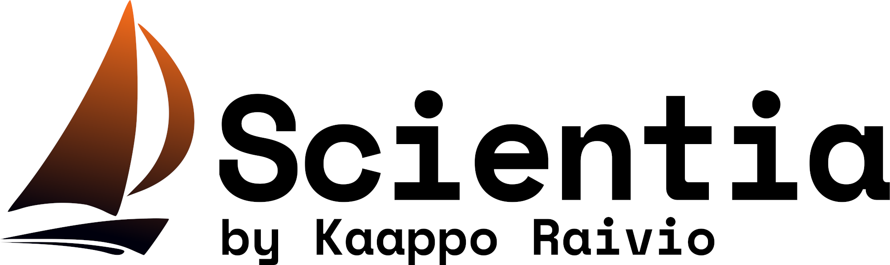
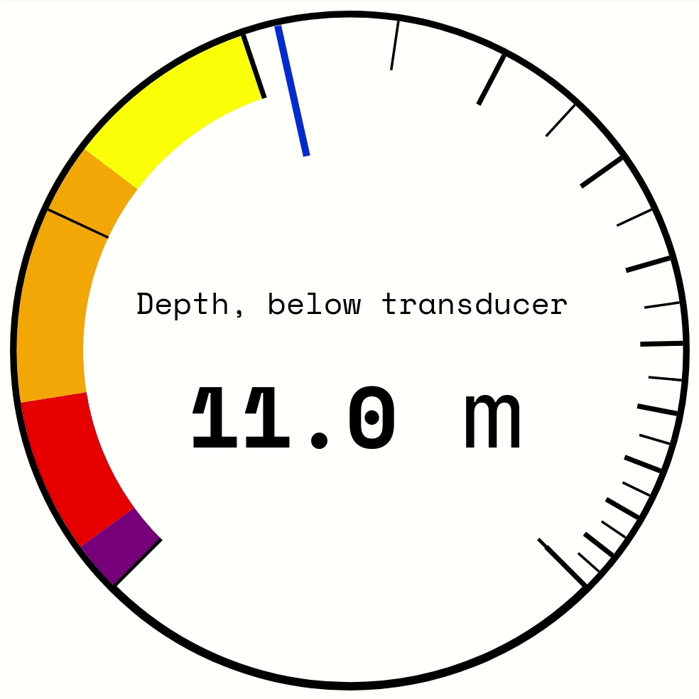
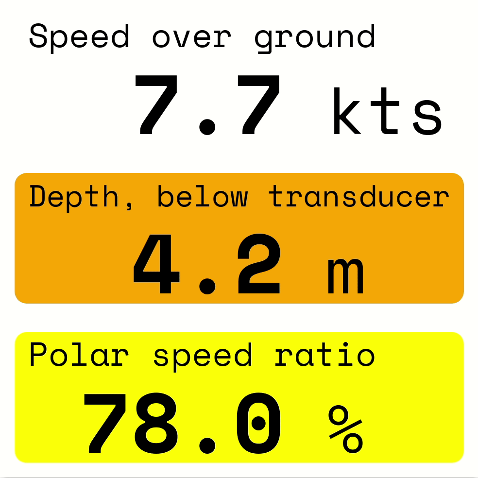
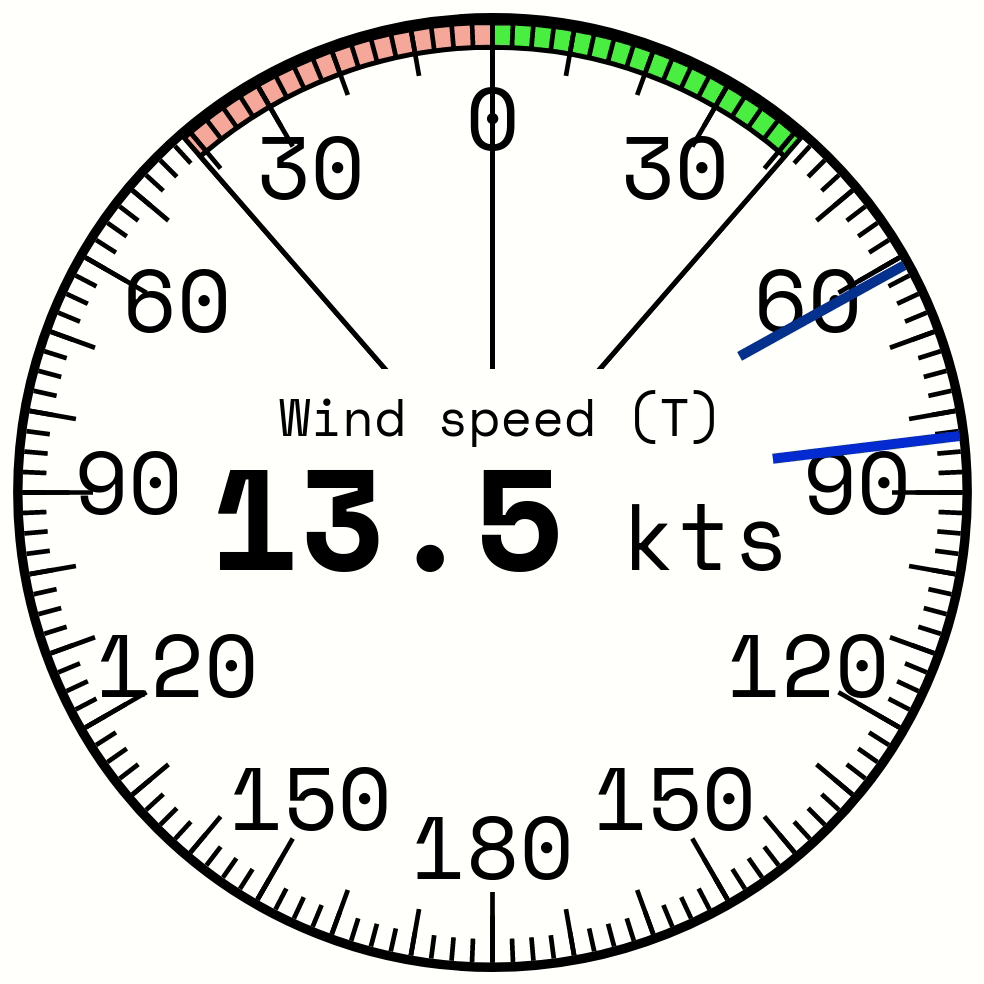

Scientia (/*ˈsaɪənˌtɪa*/) is a webapp plugin for [signalk-server-node](https://github.com/SignalK/signalk-server). 
It's capable of displaying data from the server in a clear and uncluttered way. 

## Features
_Please note the Scientia is currently in development, and more features will be coming shortly._
- [x] A responsive and adaptive UI 
- [ ] Many types of instruments. All support and honor the metadata.
  - [x] Gauge
  - [x] Numeric display
  - [x] Wind instrument
  - [x] Compass
  - [ ] Graph (Coming **really** soon (written on 2.9.2020))
  - [ ] Polar diagram (Coming before the next season (written on 2.9.2020))
- [x] Light and dark mode
- [x] Weather forecast from openWeatherMap
- [x] Saving the layout on the server
- [ ] Saving the settings on the server (coming **very** soon)
- [ ] Customiseable colors scheme
- [ ] Customiseable units

## Design objectives
My most desired use case was from the very beginning was to use my smartphone as a client. 
Phone screens are quite small, which means that the number one design goal for the project 
is **no wasted screen real estate**.

Another important factor is that I want a robust solution. This means that **no unnecessary complexity is allowed** which could break something. For example, I decided in the very beginning that  all of the instruments should conform to a grid 
(although it's possible to sub-divide the grid), and not be resizeable.  

The third objective is to make processing the information easier by **representing it in the best way possible**.

## Installation
I really appreciate your interest!
1. [Install the signalk server](https://github.com/SignalK/signalk-server#installation).
2. Find and install `Signalk-scientia-kraivio` from the app store.
3. Create and account for use with Scientia. **Make sure that it has read/write permissions**. 
It's also possible to use Scientia with an admin account, but this is not recommended.
4. Launch Scientia (Signalk-scientia-kraivio) from the webapps menu.
5. Login with your credentials. 
If you want to have the weather data displayed on the top-right corner, you [can aquire an OpenWeatherMap API key](https://openweathermap.org/price#weather), and enter it.
6. Thank you for installing Scientia!

## Background 
Displaying boat data in the browser opens up almost endless possibilities on visualising it. 
Over my 17 years of sailing (over 17 years of living :D) there have been many occasions where it would have been nice to 
have data represented in a better way than those pesky 7-segment displays (*definitely not looking at your, 
Raymarine ST60*).

Let's consider the ST60 Tridata for example: you can see the depth in one point in time, and one point only. 
Want to know, if the suddent decrease in depth is just a thermocline, or something more serious? Sorry, 
no luck for you, other than trying to guess from the cryptic arrows presented to you.

Another example with the ST60 Wind: Want to know if the wind speed trend is increasing, or if it's just a gust? Good luck trying to work 
that out from the single reading presented to you.

There are lots of other webapps for the signalk server, with the most prominent probably being mxtommys's Kip. 
For me, the problem is that none of them are particularily visually appealing.

That's why I decided to write my own. 
