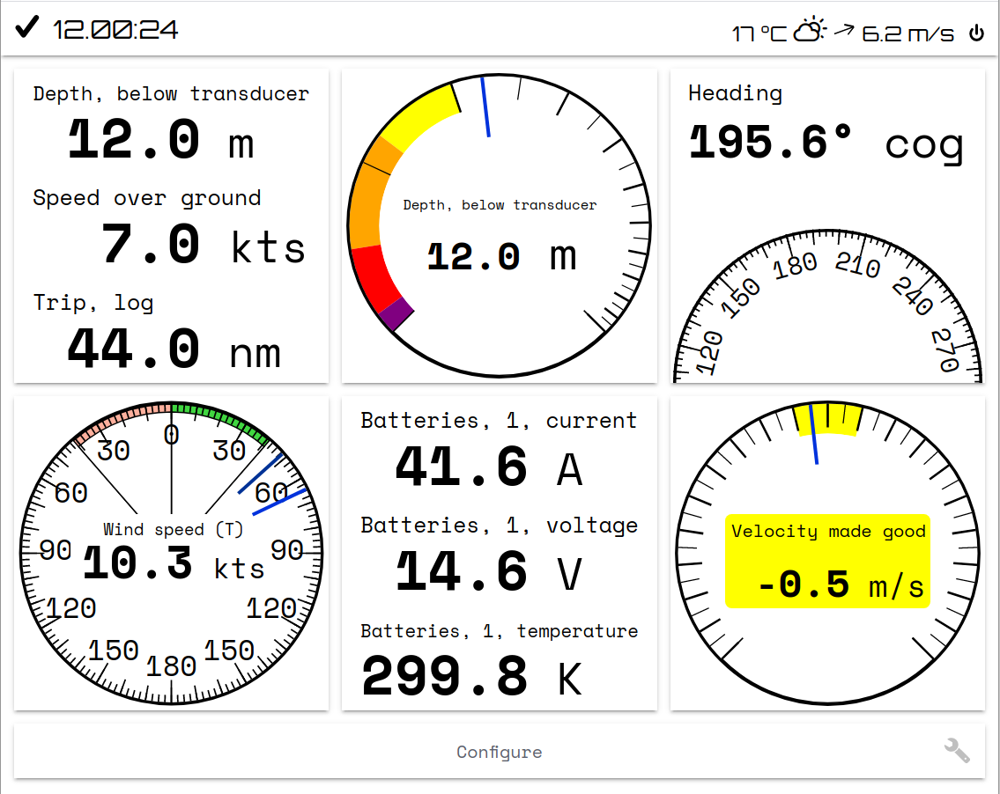
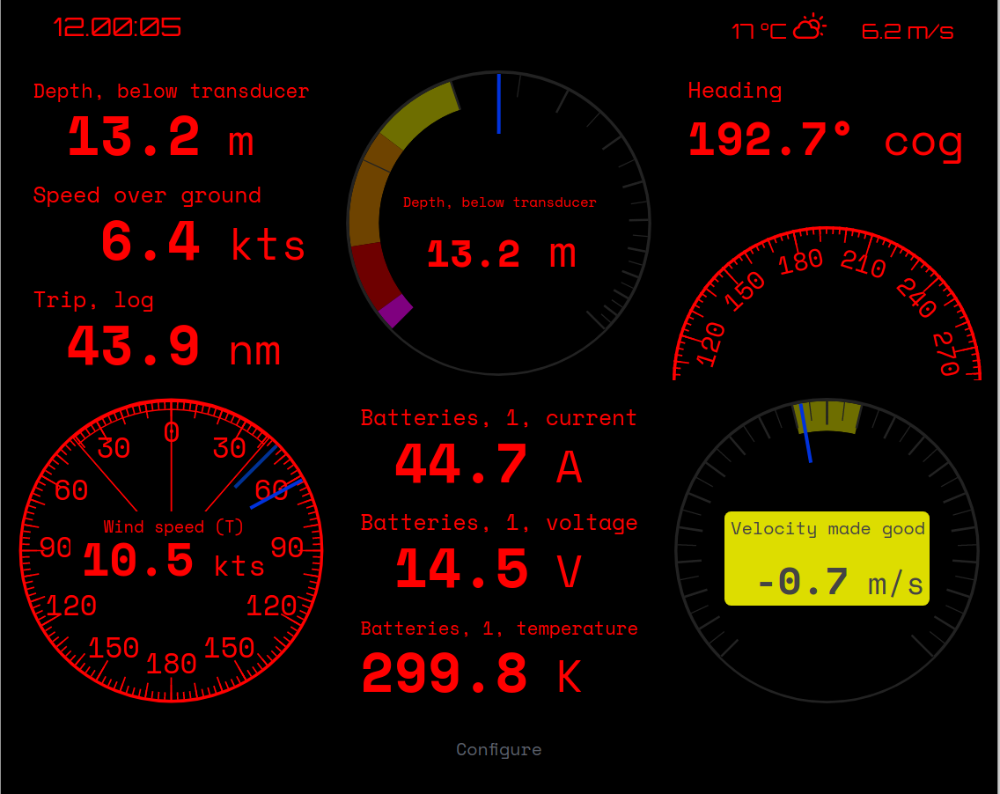

Scientia (/*ˈsaɪənˌtɪa*/) is a webapp plugin for [signalk-server-node](https://github.com/SignalK/signalk-server). 
It's capable of displaying data from the server in a clear and uncluttered way. 

## Background 
Displaying boat data in the browser opens up almost endless possibilities on visualising it. 
Over my 17 years of experience sailing there have been many occasions where it would have been nice to 
have data represented in a better way than those pesky 7-segment displays (definitely not looking at your, 
Raymarine ST60).

Let's consider the ST60 Tridata for example: you can see the depth in one point in time, and one point only. 
Want to know, if the suddent decrease in depth is just a thermocline, or something more serious? Sorry, 
no luck for you, other than trying to guess from the cryptic arrows presented to you.

Another example with the ST60 Wind: Want to know if the wind speed trend is increasing, or if it's just a gust? Good luck trying to work 
that out from the single reading presented to you.

There are lots of other webapps for the signalk server, with the most prominent probably being mxtommys's Kip. 
For me, the problem is that none of them are particularily visually appealing.

That's why I decided to write my own. 

## Design objectives
My most desired use case was from the very beginning was to use my smartphone as a client. 
Phone screens are quite small, which means that the number one design goal for the project 
is **no wasted screen real estate**.

Another important factor is that I want a robust solution. This means that **no unnecessary complexity is allowed** which could break something. For example, I decided in the very beginning that  all of the instruments should conform to a grid 
(although it's possible to sub-divide the grid), and not be resizeable.  

The third objective is to make processing the information easier by **representing it in the best way possible**.

## Features
Scientia 

Light mode | Dark mode (notice how the active warning notification color pops out)
:---:|:---:
 | 
